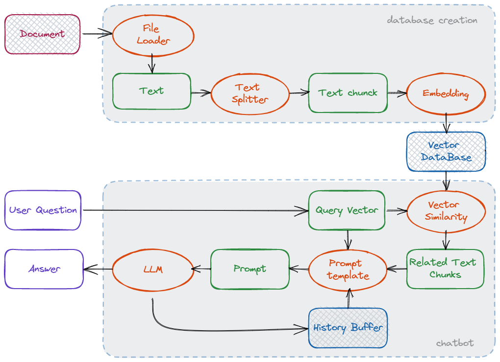
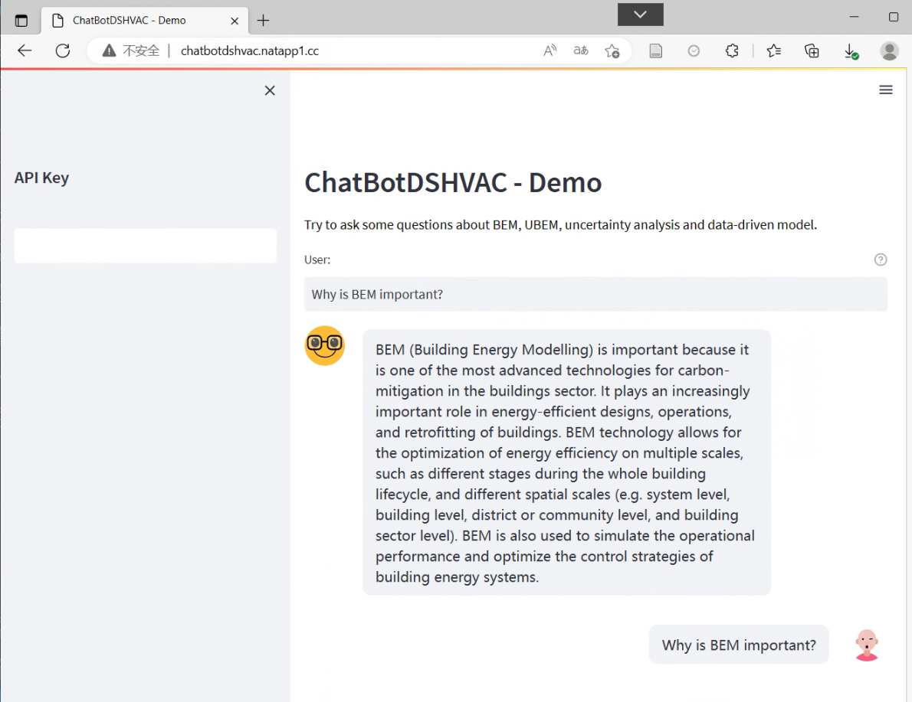
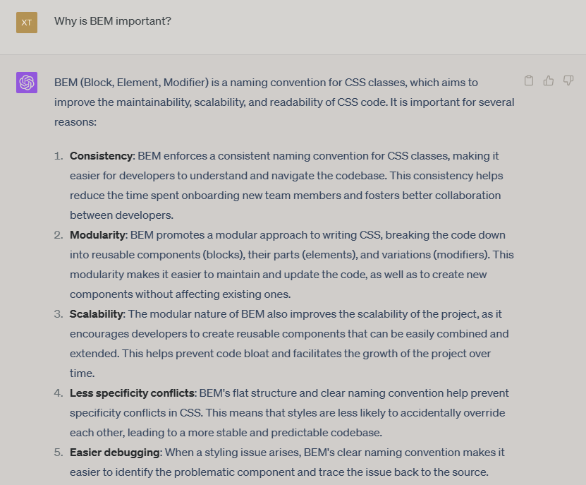

# ChatBotDSinHVAC

本项目是一个基于个人专业知识库的问答机器人，主要针对暖通空调（HVAC）领域。项目包含个人专业向量知识库的建立及问答两部分，使用 Python 语言编写而成，参考了 [LangChain-ChatGLM-Webui](https://github.com/thomas-yanxin/LangChain-ChatGLM-Webui) ，[langchain-ChatGLM](https://github.com/imClumsyPanda/langchain-ChatGLM)，[hugging-llm]()，及 [OpenChatPaper]()。本项目的初衷是为了提升大语言模型在 HVAC 领域的问答回答能力，同时降低本专业从业人员使用大语言模型的门槛。      

## 问题背景

本项目的问题背景诞生于 2022 年 12 月 ChatGPT 刚刚发布时的专业知识简单测试。根据测试结果及后续分析，虽然 ChatGPT 在 HVAC 领域具有一定的问答能力，但仍然存在普遍的概念回答不准确、知识幻觉的现象。显然，大语言模型训练时并未能获取足够的 HVAC 领域公开数据进行训练。      

初步分析 HVAC 专业的数据特点包括：     

- HVAC 专业作为地产行业及能源行业的交叉学科，数据隐私性较高，数据需经过脱敏处理才可公开，公开数据较少；
- HVAC 专业从业人员规模相对较小，知识信息化水平相对较低，公开网络上信息分散且良莠不齐，优质信息获取成本较高。     

因此，为使大语言模型更好地应用于 HVAC 垂直领域，本项目尝试从科研视角入手，使用向量数据库更新及扩充大语言模型的暖通空调基础知识。项目实践中，以本人专业 HVAC 作为背景，结合个人知识背景建立了一个初步向量知识库。

## 项目目标
本项目预期实现一个HVAC专业学生/入门科研者可用的针对领域学科基础概念的对话模型，模型支持多轮对话，根据上下文问答。    

相对于基础的大模型，其改进目标为：
- 减少问答中的 HVAC 知识幻觉；
- 增强大语言模型回答 HVAC 相关知识的能力；
- 一定程度上降低使用对话模型的门槛。

## 项目介绍

本项目实现的功能包含两大部分：

1. 个人专业向量知识库的建立；
2. 基于向量知识库的多轮问答。         

目前借助langchain+Pinecone+OpenAI API实现，使用Streamlit构建较为简单的前端。

项目的数据流如下图所示：     

对应到两个具体功能上，实现方式分别为：   
1. 读取多个不同主题的文件，对每一个文件，进行文本切割、拼接分片、嵌入、存入向量数据库；当知识需要增加时，只需读取新的文件，执行上述操作更新数据库即可。
2. 获取用户问题，在向量数据库中进行相似匹配检索，返回指定数量的结果；将结果结合问题及对话历史生成prompt，调用大语言模型生成回答。

## 使用

目前，有基于本地服务器的在线运行版本（demo不常开，可联系我）：[在线运行](http://chatbotdshvac.natapp1.cc)

已在部分例子中初步实现了对原语言模型的HVAC领域优化。如：
- 本项目当前版本的回答：

- ChatGPT的回答：错误的回答

## 后续工作

- 提升多轮对话能力；
- 扩充知识库；
- 增加开源大语言模型；
- 前端界面优化；
- ...

本项目未涉及模型微调，仅为基于向量知识库问答的简单尝试。如需进一步提升效果，可考虑微调模型。
