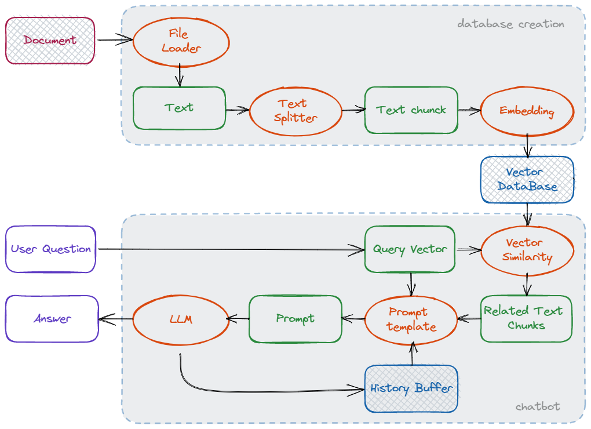
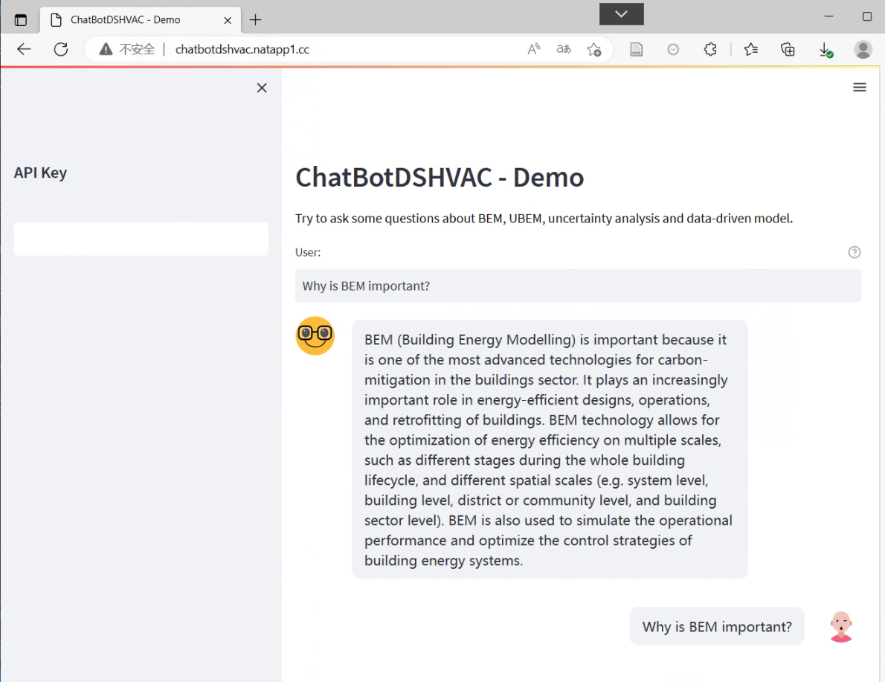
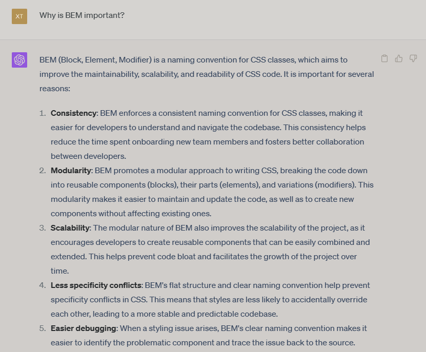

# 🤖 ChatBotDSinHVAC: Domain-Specific Knowledge Base QA Bot for HVAC

<p align="center">
  
  
  
  
  
  
</p>

<p align="center">
  <a href="README.md">English</a> | <strong>中文</strong>
</p>

---

> **说明：** 本项目为 **2023 年开发的个人项目**，主要旨在探索大语言模型（LLM）在暖通空调（HVAC）等重度垂直领域的落地与实践。

## 📑 目录
- [项目简介](#-项目简介)
- [背景与动机](#-背景与动机)
- [项目目标](#-项目目标)
- [技术栈](#-技术栈)
- [功能与架构](#-功能与架构)
- [项目结构](#-项目结构)
- [安装与运行](#-安装与运行)
- [使用演示](#-使用演示)
- [后续工作](#-后续工作)
- [致谢](#-致谢)

### 🌟 项目简介
本项目是一个基于个人专业知识库的智能问答机器人，专为**暖通空调（HVAC）**领域设计。项目包含专业向量知识库的构建与基于知识库的问答两部分内容，致力于提升大语言模型（LLM）在 HVAC 领域的回答准确性，并降低从业人员使用 AI 的门槛。

### ❓ 背景与动机
本项目起源于 2022 年 12 月 ChatGPT 刚发布时的[专业知识测试](https://mp.weixin.qq.com/s/YxXkTFGD5j37AglY6_GaSQ)。测试表明，尽管大模型在 HVAC 领域具备一定的问答能力，但常常出现概念混淆与“知识幻觉”。这主要是因为公开域缺乏高质量的 HVAC 领域训练数据。

HVAC 专业的数据具备以下特点：
- **隐私壁垒高**：作为地产与能源的交叉学科，行业数据脱敏成本高，开源数据极少。
- **知识碎片化**：从业规模相对较小，网络信息分散且良莠不齐，获取优质信息成本高。

因此，本项目尝试从科研视角切入，利用向量数据库结合 LangChain 框架（即 RAG 技术），动态扩充与更新大语言模型的专业认知边界。

### 🎯 项目目标
预期打造一套适合 HVAC 专业学生、入门科研者及工程师使用的专业对话基座。它的核心改进目标包括：
- 显著减少问答过程中的 HVAC 专业“知识幻觉”。
- 增强大模型处理复杂 HVAC 问题的逻辑与知识储备。
- 降低垂直领域从业者利用 AI 提效的技术门槛。

### 💻 技术栈
- **编程语言：** Python 3.7+
- **大模型框架：** [LangChain](https://github.com/hwchase17/langchain)
- **向量数据库：** [Pinecone](https://www.pinecone.io/)
- **核心模型：** OpenAI API
- **前端交互：** [Streamlit](https://streamlit.io/)
- **后端服务：** [Flask](https://flask.palletsprojects.com/)

### 🛠️ 功能与架构
本系统基于上述技术栈构建。

核心功能流程分为两步：
1. **向量知识库构建**：
   - 自动读取多样化的本地知识文档。
   - 对文本进行清洗、切分（Chunking）、特征嵌入（Embedding），并持久化至向量数据库。
   - 支持动态热更新，只需存入新文件即可自动扩充知识库。
2. **多轮问答检索（RAG）**：
   - 接收用户自然语言提问，在向量数据库中进行语义相似度检索。
   - 提取 Top-K 相关文本内容，结合历史对话上下文组装 Prompt。
   - 驱动大语言模型生成具备准确参考来源的专业回答。

**数据流架构图：**



### 📁 项目结构
```text
ChatBotDSinHVAC/
├── pic/                        # README 和前端界面使用的图片
├── scripts/                    # 额外工具脚本
├── utils/                      # 核心功能辅助模块
├── frontend.py                 # Streamlit Web 前端主程序（历史归档）
├── backend.py                  # 核心后端逻辑（检索 RAG、调用 LLM）（历史归档）
├── baseclass.py                # 基础类与数据结构定义
├── createDB.py                 # 向量数据库构建与更新核心脚本
├── logWriter.py                # 日志记录模块
├── requirements.txt            # 运行所需依赖列表
└── README_zh.md                # 中文项目文档
```

### 💻 安装与使用说明

1. **克隆项目到本地：**
   ```bash
   git clone https://github.com/SheltonXiao/ChatBotDSinHVAC.git
   cd ChatBotDSinHVAC
   ```

2. **配置运行环境：**
   推荐使用 **Python 3.7+** 环境，安装相关依赖：
   ```bash
   pip install -r requirements.txt
   ```

3. **初始化个人向量数据库：**
   如果您希望构建私人知识库：
   - 提前配置好 **OpenAI** 与 **Pinecone** 的 API 密钥。
   - 在项目根目录手工新建 `data/` 文件夹。
   - 将您的脱敏专业文档放入 `data/` 目录中。
   - 运行知识库构建脚本：
   ```bash
   python createDB.py
   ```

4. **运行问答应用（历史前后端）：**
   > *说明：原仓库中包含的 `frontend.py` 和 `backend.py` 等前后端服务代码已不再同步更新（处于历史归档状态），但仍可用于参考或本地启动测试。*
   
   首先，启动 Flask 后端服务：
   ```bash
   python backend.py
   ```
   
   然后，打开一个新的终端窗口，启动 Streamlit 前端界面：
   ```bash
   streamlit run frontend.py
   ```

### 🚀 使用演示
目前项目部署了基于本地服务器的在线体验版本（*注：Demo 并非 24 小时开启，如无法访问可联系作者*）：[在线体验](http://chatbotdshvac.natapp1.cc)

**优化效果对比：**
通过外挂知识库，项目有效纠正了通用大模型的常识性错误：
- **本项目的回答（准确专业）：**
  
- **ChatGPT 裸跑回答（存在概念错误）：**
  

### 🔮 后续工作
- 优化多轮对话的意图识别与记忆机制。
- 持续丰富并筛选高质量底层文档库。
- 接入更多优秀的开源本地化大模型（如 ChatGLM、Llama），实现数据完全私有化。
- 升级打磨前端交互体验。

*(注：本项目主要为 2023 年基于向量知识库问答（RAG）的早期实践，暂未涉及大模型微调。若需进一步深挖垂直能力，探索模型微调将是必要方向。)*

### 🙏 致谢
在开发过程中，本项目的技术路线学习与参考了以下优秀的开源项目，在此表示诚挚感谢：
- [LangChain-ChatGLM-Webui](https://github.com/thomas-yanxin/LangChain-ChatGLM-Webui)
- [langchain-ChatGLM](https://github.com/imClumsyPanda/langchain-ChatGLM)
- [hugging-llm](https://github.com/datawhalechina/hugging-llm)
- [OpenChatPaper](https://github.com/liuyixin-louis/OpenChatPaper)
